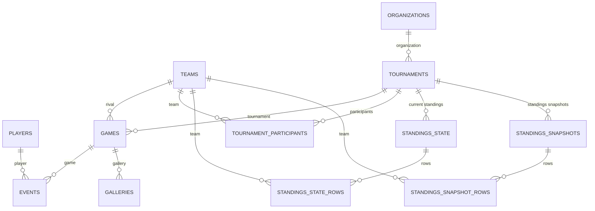

# Modelo de datos

Este documento describe el modelo actual de datos de Mentira FC en Sanity y como lo consume la web.

Fuente principal:

- Esquemas editoriales: `studio/schemas/*.schema.js`
- Queries y adaptadores web: `web/src/data/sanity/*`
- Modelos de dominio: `web/src/types/models.ts`

## Resumen

Hoy existen estos documentos de Sanity:

| Documento | Descripcion | Estado |
|---|---|---|
| `players` | Jugadores del plantel | Activo |
| `staff` | Staff y cuerpo tecnico del plantel | Activo |
| `news` | Noticias y notas editoriales | Activo |
| `galleries` | Galerias de fotos asociadas a partidos finalizados | Activo |
| `games` | Partidos de Mentira FC | Activo |
| `events` | Eventos asociados a partidos, hoy solo goles | Activo |
| `teams` | Equipos, rivales y equipo principal | Activo |
| `tournaments` | Torneos con organizador, reglas de tabla y participantes oficiales | Activo |
| `standingsState` | Tabla actual editable por torneo | Activo |
| `standingsSnapshots` | Historial generado de tablas por fecha de torneo | Activo |
| `organizations` | Organizadores/marcas de torneos | Activo |

## Convenciones generales

- Todos los documentos tienen los campos nativos de Sanity (`_id`, `_type`, `_createdAt`, `_updatedAt`, etc.).
- Las imagenes son assets de Sanity. En la web normalmente se consumen como URL resuelta (`imageUrl`, `logoUrl`) o como referencia de asset segun el caso.
- Las relaciones se modelan con campos `reference`.
- Los `slug` se usan para URLs publicas en jugadores y noticias.
- La web no consume los esquemas crudos directamente: primero valida respuestas con Zod y despues adapta a modelos de dominio.

## `players`

Representa un jugador del plantel.

Schema: `studio/schemas/players.schema.js`

Campos:

| Campo | Tipo | Requerido | Descripcion |
|---|---|---:|---|
| `name` | `string` | Si | Nombre del jugador. |
| `lastName` | `string` | Si | Apellido del jugador. |
| `number` | `number` | Si | Numero de camiseta. Minimo `0`. |
| `position` | `string` | Si | Posicion principal. Valores: `arq`, `def`, `med`, `del`. |
| `dominantFoot` | `string` | No | Pie habil. Valores: `right`, `left`. |
| `birthDate` | `date` | No | Fecha de nacimiento. |
| `photo` | `image` | No | Foto del jugador, con hotspot. |
| `isActive` | `boolean` | No | Controla si el jugador aparece en el plantel publico. Por defecto `true`. Los documentos inactivos conservan referencias historicas. |
| `slug` | `slug` | Si | Slug canonico para URL publica. Se genera desde nombre y apellido. |

Uso en web:

- Query principal: `PLAYERS_QUERY` (solo jugadores con `isActive != false`)
- Query de detalle: `PLAYER_BY_SLUG_OR_ID_QUERY` (sin filtrar por `isActive`, para conservar URLs historicas)
- Modelo de dominio: `Player`
- La web deriva `fullName` como `${name} ${lastName}`.
- Las estadisticas de goles no viven en `players`; se calculan desde `events` de tipo `goal`.

Relaciones actuales:

- `events.player -> players`

Relaciones faltantes/proximas:

- Agregar atributos editables del jugador.
- Agregar mapa de posiciones para representar mejor posicion principal, posiciones secundarias o ubicacion en cancha.
- Agregar redes sociales del jugador.
- Contabilizar partidos jugados. La fuente deberia salir de la convocatoria de cada `game`, no cargarse manualmente en el jugador.
- Agregar premios internos en cada jugador.

## `staff`

Representa integrantes del staff o cuerpo tecnico del plantel.

Schema: `studio/schemas/staff.schema.js`

Campos:

| Campo | Tipo | Requerido | Descripcion |
|---|---|---:|---|
| `name` | `string` | Si | Nombre del integrante. |
| `lastName` | `string` | Si | Apellido del integrante. |
| `role` | `string` | Si | Rol que cumple en el equipo. |
| `birthDate` | `date` | No | Fecha de nacimiento. |
| `photo` | `image` | No | Foto del integrante, con hotspot. |
| `slug` | `slug` | Si | Slug canonico para URL publica. Se genera desde nombre y apellido. |

Uso en web:

- Query principal: `STAFF_QUERY`
- Query de detalle: `STAFF_BY_SLUG_OR_ID_QUERY`
- Modelo de dominio: `StaffMember`
- La web deriva `fullName` como `${name} ${lastName}`.
- No se contabilizan goles y no tiene numero de camiseta.

Relaciones actuales:

- No tiene referencias a otros documentos.

Relaciones faltantes/proximas:

- Agregar redes sociales del integrante.

## `news`

Representa una noticia o articulo editorial.

Schema: `studio/schemas/news.schema.js`

Campos:

| Campo | Tipo | Requerido | Descripcion |
|---|---|---:|---|
| `title` | `string` | Si | Titulo de la noticia. |
| `description` | `string` | Si | Bajada o descripcion corta. |
| `content` | `array` de `block`, `image` y `video` | Si | Contenido rico Portable Text. Los bloques de texto permiten `h2`, `h3`, citas, listas, negrita, cursiva, subrayado y enlaces; las imagenes internas exigen `alt` y pueden llevar epigrafe. |
| `image` | `image` | Si | Imagen principal, con hotspot. Incluye `alt` obligatorio para accesibilidad y SEO. |
| `date` | `datetime` | Si | Fecha de publicacion o referencia editorial. Tiene valor inicial automatico. |
| `slug` | `slug` | Si | Slug para URL publica. Se genera desde `title`. |

Uso en web:

- Query principal: `NEWS_QUERY`
- Query de detalle: `NEWS_BY_SLUG_QUERY`
- Queries relacionadas: `SUGGESTED_NEWS_QUERY`, `FALLBACK_NEWS_QUERY`
- Modelo de dominio: `NewsItem`
- El dashboard puede guardar cambios como documentos `drafts.*` de Sanity. Las queries publicas fuerzan contenido publicado y excluyen drafts.

Relaciones actuales:

- No tiene referencias a otros documentos.

Relaciones faltantes/proximas:

- Relacionar noticias con datos del sitio: `players`, futuro `staff`, `games`, `tournaments`, etc.
- Agregar votaciones dentro o asociadas a noticias.
- Agregar comentarios en noticias, probablemente vinculados al futuro modelo de `usuarios`.

## `galleries`

Representa una galeria de fotos asociada a un partido finalizado.

Schema: `studio/schemas/galleries.schema.js`

Campos:

| Campo | Tipo | Requerido | Descripcion |
|---|---|---:|---|
| `game` | `reference -> games` | Si | Partido finalizado al que pertenece la galeria. |
| `slug` | `slug` | Si | Slug para URL publica. |
| `photos` | `array` de fotos | Si | Fotos de la galeria. Debe tener al menos una foto. |
| `photos[].image` | `image` | Si | Imagen de la galeria, con hotspot. |
| `photos[].isHero` | `boolean` | No | Marca la foto usada como hero en la card. Debe haber exactamente una. |
| `photos[].alt` | `string` | Si | Texto alternativo de la foto. |
| `photos[].caption` | `string` | No | Epigrafe opcional. |

Uso en web:

- Query principal: `GALLERIES_QUERY`
- Query de detalle: `GALLERY_BY_SLUG_QUERY`
- Modelo de dominio: `GalleryItem`, `GalleryImage`
- El listado se ordena por fecha del partido, de mas reciente a mas vieja.
- El titulo publico se deriva del partido: torneo, Mentira FC, goles, rival y goles del rival.
- El detalle muestra todas las fotos en un bento grid basado en la dimension de cada imagen y cada foto tiene descarga.

Relaciones actuales:

- `galleries.game -> games`

## `games`

Representa un partido de Mentira FC contra un rival.

Schema: `studio/schemas/games.schema.js`

Campos:

| Campo | Tipo | Requerido | Descripcion |
|---|---|---:|---|
| `rival` | `reference -> teams` | Si | Equipo rival. |
| `date` | `datetime` | Si | Fecha y hora del partido. |
| `location` | `string` | Si | Ubicacion del partido. |
| `competition` | `string` | Si | Tipo de competencia. Valores: `Torneo`, `Copa`, `Amistoso`. |
| `tournament` | `reference -> tournaments` | Si para `Torneo` | Torneo asociado. Se oculta si `competition !== "Torneo"`. |
| `state` | `string` | Si | Estado del partido. Valores: `por_jugar`, `finalizado`. |
| `result` | `object` | Si cuando esta finalizado | Resultado del partido. Se oculta si `state !== "finalizado"`. |
| `result.goalsFor` | `number` | Si | Goles de Mentira FC. Minimo `0`. |
| `result.goalsAgainst` | `number` | Si | Goles del rival. Minimo `0`. |

Uso en web:

- Ultimos partidos: `LATEST_GAMES_QUERY`
- Partidos finalizados: `FINISHED_GAMES_QUERY`
- Partidos finalizados de torneo: `FINISHED_TOURNAMENT_GAMES_QUERY`
- Home: `HOME_CRITICAL_QUERY`
- Modelo de dominio: `Game`

La web embebe los goles del partido con una subquery a `events`:

```groq
*[_type == "events" && game._ref == ^._id && type == "goal"]
```

Relaciones actuales:

- `games.rival -> teams`
- `games.tournament -> tournaments`
- `events.game -> games`

Relaciones faltantes/proximas:

- Agregar convocatoria al partido.
- Usar la convocatoria como fuente para contabilizar partidos jugados por jugador en el año.

## `events`

Representa un evento ocurrido en un partido. Actualmente se usa solo para goles.

Schema: `studio/schemas/events.schema.js`

Campos:

| Campo | Tipo | Requerido | Descripcion |
|---|---|---:|---|
| `game` | `reference -> games` | Si | Partido al que pertenece el evento. |
| `type` | `string` | Si | Tipo de evento. Hoy solo existe `goal`. |
| `player` | `reference -> players` | No | Jugador asociado al evento. |
| `order` | `number` | Si | Numero de gol en el partido. Minimo `1`. |

Uso en web:

- Query global de goles: `GOAL_EVENTS_QUERY`
- Subqueries dentro de `games` para traer goles por partido.
- Modelos de dominio: `MatchEvent`, `GoalEvent`
- Estadisticas: `getTopScorers`, `getPlayerStats`

Relaciones actuales:

- `events.game -> games`
- `events.player -> players`

Relaciones faltantes/proximas:

- Agregar la opcion de indicar asistencias, por ejemplo con una referencia `assist -> players` en eventos de tipo `goal`.

## `teams`

Representa equipos. Sirve tanto para rivales como para identificar el equipo principal de Mentira FC.

Schema: `studio/schemas/teams.schema.js`

Campos:

| Campo | Tipo | Requerido | Descripcion |
|---|---|---:|---|
| `name` | `string` | Si | Nombre del equipo. |
| `logo` | `image` | Si | Escudo del equipo. |
| `isMain` | `boolean` | Si | Marca si es el equipo principal. Valor inicial `false`. |

Uso en web:

- Query principal: `TEAMS_QUERY`
- Modelo de dominio: `TeamRef`
- Se usa en tablas de posiciones y partidos.
- `isMain` permite calcular estadisticas del equipo principal en la tabla hibrida.

Relaciones actuales:

- `games.rival -> teams`
- `standingsState.rows[].team -> teams`
- `standingsSnapshots.rows[].team -> teams`

Relaciones faltantes/proximas:

- No agregar mas campos por ahora. El modelo actual esta bien como esta.

## `tournaments`

Representa un torneo o competencia organizada por una organizacion.

Schema: `studio/schemas/tournaments.schema.js`

Campos:

| Campo | Tipo | Requerido | Descripcion |
|---|---|---:|---|
| `name` | `string` | Si | Nombre del torneo. |
| `organization` | `reference -> organizations` | Si | Organizador del torneo. |
| `active` | `boolean` | Si | Indica si es el torneo activo que consume la web. |
| `primaryPrizeSlots` | `number` | Si | Cantidad de equipos que clasifican al primer premio. Valor inicial `1`. |
| `secondaryPrizeSlots` | `number` | Si | Cantidad de equipos que clasifican al segundo premio. Valor inicial `4`. |
| `participants` | `array` | Si | Lista oficial de equipos que pueden cargarse manualmente en `standingsState.rows`. No incluye Mentira FC. |
| `participants[].team` | `reference -> teams` | Si | Equipo participante del torneo. |
| `participants[].status` | `string` | Si | Estado del participante. Valores: `active`, `replaced`, `withdrawn`. |
| `participants[].activeFromMatchday` | `number` | No | Fecha desde la cual el equipo cuenta como participante activo. |
| `participants[].activeUntilMatchday` | `number` | No | Fecha hasta la cual el equipo cuenta como participante activo. |
| `participants[].notes` | `text` | No | Nota interna para reemplazos, retiros u otros ajustes. |

Uso en web:

- Query principal: `TOURNAMENT_QUERY`
- Modelo de dominio: `Tournament`
- La web busca el primer torneo con `active == true`.
- La tabla sale de los ultimos `standingsSnapshots` generados para el torneo activo.
- Si no hay snapshots, la web no arma una tabla legacy desde `tournaments`: espera que exista `standingsState` y que la Function genere el snapshot.
- La web calcula la fila de Mentira FC desde partidos finalizados y la inserta automaticamente.
- La web calcula `points`, `goalDiff`, `position`, `type` (`primaryPrize`, `secondaryPrize`, `normal`) y `positionChange`.
- `participants` no se carga en la web publica: funciona como lista editorial oficial para validar la carga de `standingsState`.

Relaciones actuales:

- `tournaments.organization -> organizations`
- `tournaments.participants[].team -> teams`
- `standingsState.tournament -> tournaments`
- `standingsSnapshots.tournament -> tournaments`
- `games.tournament -> tournaments`

Relaciones faltantes/proximas:

- No agregar mas campos por ahora. La tabla editorial vive en `standingsState` y la lista oficial de equipos vive en `tournaments.participants`.

## `standingsState`

Representa la tabla actual editable de un torneo. Es el documento que se modifica fecha a fecha.

Schema: `studio/schemas/standingsState.schema.js`

Campos:

| Campo | Tipo | Requerido | Descripcion |
|---|---|---:|---|
| `tournament` | `reference -> tournaments` | Si | Torneo al que pertenece la tabla actual. Debe existir un solo documento por torneo. |
| `matchdayNumber` | `number` | Si | Numero explicito de fecha que se usara para generar el snapshot. |
| `label` | `string` | No | Etiqueta visible, por ejemplo `Fecha 7`. |
| `snapshotDate` | `datetime` | Si | Fecha visible de publicacion de la tabla. No depende de `_updatedAt`. |
| `gamesThroughDate` | `datetime` | Si | Corte usado para calcular automaticamente los partidos de Mentira FC incluidos en esa tabla. |
| `rows` | `array` | Si | Filas editables de rivales/equipos del torneo. No se carga Mentira FC. |
| `rows[].team` | `reference -> teams` | Si | Equipo de la fila. |
| `rows[].wins` | `number` | Si | Partidos ganados. |
| `rows[].draws` | `number` | Si | Partidos empatados. |
| `rows[].losses` | `number` | Si | Partidos perdidos. |
| `rows[].goalsFor` | `number` | Si | Goles a favor. |
| `rows[].goalsAgainst` | `number` | Si | Goles en contra. |

Uso en backend:

- `sync-standings-snapshot` escucha creaciones y actualizaciones publicadas de `standingsState`.
- La Function valida que todas las filas pertenezcan a `tournaments.participants` activos para esa fecha.
- La Function rechaza la generacion del snapshot si falta un participante activo, sobra un equipo, hay duplicados o se cargo Mentira FC manualmente.
- La Function calcula Mentira FC desde `games`, deriva `played`, `points`, `goalDiff`, `position` y movimiento.
- La Function crea o actualiza un `standingsSnapshots` con ID deterministico por torneo y fecha.

Relaciones actuales:

- `standingsState.tournament -> tournaments`
- `standingsState.rows[].team -> teams`

## `standingsSnapshots`

Representa una tabla de posiciones historica generada para una fecha concreta de un torneo.

Schema: `studio/schemas/standingsSnapshots.schema.js`

Campos:

| Campo | Tipo | Requerido | Descripcion |
|---|---|---:|---|
| `tournament` | `reference -> tournaments` | Si | Torneo al que pertenece la tabla generada. |
| `matchdayNumber` | `number` | Si | Numero explicito de fecha. Se usa para ordenar y comparar snapshots. |
| `label` | `string` | No | Etiqueta visible, por ejemplo `Fecha 7`. |
| `snapshotDate` | `datetime` | Si | Fecha visible de publicacion de la tabla. No depende de `_updatedAt`. |
| `gamesThroughDate` | `datetime` | Si | Corte usado para calcular automaticamente los partidos de Mentira FC incluidos en esa tabla. |
| `rows` | `array` | Si | Filas generadas automaticamente. |
| `rows[].team` | `reference -> teams` | Si | Equipo de la fila. |
| `rows[].played` | `number` | Si | Partidos jugados calculados. |
| `rows[].wins` | `number` | Si | Partidos ganados. |
| `rows[].draws` | `number` | Si | Partidos empatados. |
| `rows[].losses` | `number` | Si | Partidos perdidos. |
| `rows[].goalsFor` | `number` | Si | Goles a favor. |
| `rows[].goalsAgainst` | `number` | Si | Goles en contra. |
| `rows[].points` | `number` | Si | Puntos calculados. |
| `rows[].goalDiff` | `number` | Si | Diferencia de gol calculada. |
| `rows[].position` | `number` | Si | Posicion calculada. |
| `rows[].previousPosition` | `number` | No | Posicion de la fecha anterior cuando existe. |
| `rows[].positionChange` | `number` | No | Puestos subidos o bajados contra la fecha anterior. |

Uso en web:

- `TOURNAMENT_QUERY` trae los ultimos dos snapshots del torneo activo.
- El snapshot mas reciente arma la tabla actual.
- El snapshot anterior permite calcular cuantos puestos subio o bajo cada equipo.
- Mentira FC no se carga manualmente en `standingsState.rows`: se calcula desde `games` usando `gamesThroughDate`.

Relaciones actuales:

- `standingsSnapshots.tournament -> tournaments`
- `standingsSnapshots.rows[].team -> teams`

## `organizations`

Representa una organizacion que administra o identifica un torneo.

Schema: `studio/schemas/organizations.schema.js`

Campos:

| Campo | Tipo | Requerido | Descripcion |
|---|---|---:|---|
| `name` | `string` | Si | Nombre de la organizacion. |
| `logo` | `image` | No | Logo de la organizacion, con hotspot. |
| `primaryColor` | `color` | No | Color principal asociado a la organizacion/torneo. Sin alpha. |

Uso en web:

- Se consume a traves de `tournaments`.
- Aporta nombre, logo y color al torneo activo.

Relaciones actuales:

- `tournaments.organization -> organizations`

Relaciones faltantes/proximas:

- No agregar mas campos por ahora. El modelo actual queda tal cual.

## Relaciones actuales



Notas:

- `STANDINGS_SNAPSHOT_ROWS` no es un documento independiente. Es un objeto embebido dentro de `standingsSnapshots.rows`.
- `STANDINGS_STATE_ROWS` no es un documento independiente. Es un objeto embebido dentro de `standingsState.rows`.
- `TOURNAMENT_PARTICIPANTS` no es un documento independiente. Es un objeto embebido dentro de `tournaments.participants`.
- `news` no esta relacionado con otros documentos en el modelo actual.
- `teams.isMain` funciona como marca logica para identificar a Mentira FC dentro de calculos y tablas.

## Relaciones faltantes para proximas funciones

Estas relaciones y modelos no existen hoy en Sanity. Quedan documentados como pendientes/proximos segun lo hablado.

| Modelo o necesidad | Cambio propuesto | Motivo |
|---|---|---|
| `players` | Agregar atributos, mapa de posiciones, redes sociales y premios internos. | Enriquecer el perfil publico del jugador. |
| `players` / `games` | Calcular partidos jugados desde la convocatoria del partido. | Evitar cargar partidos jugados manualmente y usar el partido como fuente real. |
| `news` | Relacionar noticias con `players`, `staff`, `games`, `tournaments`, etc. | Permitir contenido relacionado y contexto deportivo dentro de cada noticia. |
| `news` / `usuarios` | Agregar votaciones y comentarios. | Habilitar participacion de usuarios en el sitio. |
| `staff` | Agregar redes sociales. | Enriquecer el perfil publico del staff. |
| `games` | Agregar convocatoria al partido. | Permite mostrar convocados y contabilizar partidos jugados por jugador en el año. |
| `events` | Agregar asistencia en eventos de gol (`assist -> players`). | Permite registrar quien asistio y calcular estadisticas de asistencias. |
| `teams` | Sin cambios previstos. | El modelo actual esta bien como esta. |
| `tournaments` / `standingsState` / `standingsSnapshots` | Mantener `standingsState` como unica fuente editorial de tablas y `tournaments.participants` como lista oficial de equipos. | Dejar una sola carga manual para tablas con memoria automatica y evitar equipos incorrectos. |
| `organizations` | Sin cambios previstos. | El modelo actual queda tal cual. |
| `usuarios` | Crear modelo/sistema de usuarios con login, pagina de usuario y roles `admin`, `editor`, `user`. | Base para perfiles, permisos y participacion. |
| `usuarios` | Permitir comentar noticias, participar en votaciones y convertirse en socio con metodo de pago. | Agregar comunidad, membresia y monetizacion. |

## Modelo de dominio en la web

La web adapta los documentos de Sanity a modelos propios:

| Sanity | Dominio web | Archivo |
|---|---|---|
| `players` | `Player`, `PlayerWithGoals` | `web/src/types/models.ts` |
| `staff` | `StaffMember` | `web/src/types/models.ts` |
| `news` | `NewsItem` | `web/src/types/models.ts` |
| `galleries` | `GalleryItem`, `GalleryImage` | `web/src/types/models.ts` |
| `games` | `Game`, `GameResult` | `web/src/types/models.ts` |
| `events` | `MatchEvent`, `GoalEvent` | `web/src/types/models.ts` |
| `teams` | `TeamRef` | `web/src/types/models.ts` |
| `tournaments` / `standingsSnapshots` | `Tournament`, `StandingsSnapshot`, `StandingsRow` | `web/src/types/models.ts` |

La capa de dominio calcula datos derivados:

- Goles por jugador desde `games.events`.
- Partidos con goles por jugador.
- Puntos de tabla: `wins * 3 + draws`.
- Partidos jugados de filas manuales: `wins + draws + losses`.
- Diferencia de gol: `goalsFor - goalsAgainst`.
- Posicion de tabla, movimiento contra la fecha anterior y tipo de premio segun `primaryPrizeSlots` y `secondaryPrizeSlots`.

## Observaciones tecnicas

- Hay diferencias entre campos editoriales y campos de consumo web. Ejemplo: `photo` se proyecta como `imageUrl`; `rival.logo` se proyecta como `logoUrl`.
- `games.result` solo se edita cuando el partido esta finalizado, pero el adaptador web normaliza goles faltantes a `0`.
- `events.player` no es requerido en Sanity, por eso la web permite eventos sin jugador asociado.
- `standingsState.rows` es manual para rivales/equipos del torneo, pero Mentira FC se inserta automaticamente con estadisticas calculadas desde partidos finalizados hasta `gamesThroughDate`.
- `standingsState.rows` solo debe contener equipos activos de `tournaments.participants` para esa fecha.
- `standingsSnapshots.rows` es generado automaticamente por Sanity Functions y queda como historial.
- Si el torneo cambia de participantes, se marca el equipo saliente como `replaced` o `withdrawn` con `activeUntilMatchday`, y se agrega el nuevo equipo con `activeFromMatchday`.
- El texto de algunos titles del Studio aparece con problemas de encoding en los archivos actuales, pero eso no cambia la forma del modelo.
